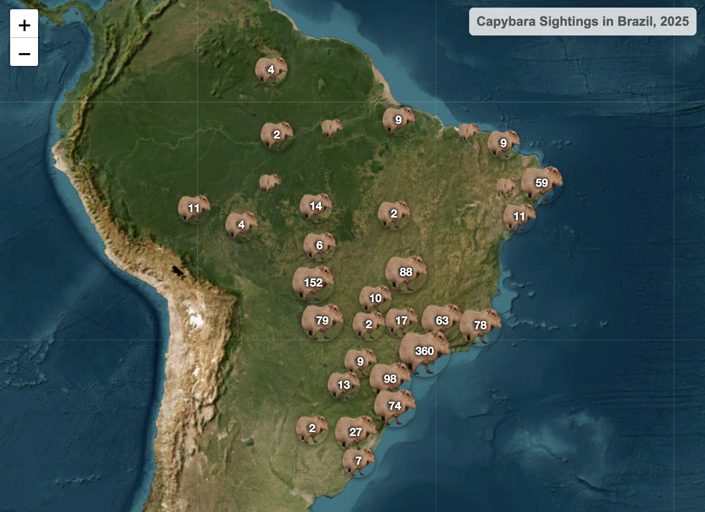

 ### 🐹 Capybara Sightings Tracker

An interactive map of capybara sightings across Brazil in 2025, built in R using citizen-science data from GBIF/iNaturalist. Sightings are plotted as clustered markers that break apart into individual capybara icons on zoom, each linking back to the original observation.

A snapshot of the map:

---


---
## Overview
 
Capybaras are my favorite animal, so I wanted a project that tied together something I actually care about with coding practice. This project was especially useful for practicing data cleaning and map creation, two things I'd never done before.
 
**Question:** Where and when are capybaras being sighted across Brazil, and what does that distribution actually reflect?
 
## Data Source
 
Observation records were pulled from [GBIF](https://www.gbif.org/) (Global Biodiversity Information Facility) via the `rgbif` R package, sourced from iNaturalist's research-grade citizen-science observations.
 
- **Species:** *Hydrochoerus hydrochaeris*
- **Region:** Brazil
- **Time range:** January 1 – December 31, 2025
- **Records pulled:** 1,247 (matched against `occ_count()` to confirm no records were dropped by API pagination limits)
## Methodology
 
The pipeline is split into numbered scripts, run in order:
 
| Script | Purpose |
|---|---|
| `01_pull_data.R` | Queries the GBIF API via `rgbif`, verifies record count against `occ_count()` |
| `02_clean.R` | Selects relevant columns, applies data quality filters, saves a clean dataset |
| `03_explore.R` | Exploratory plots (sightings by month) |
| `04_map.R` | Builds the interactive leaflet map and exports it as standalone HTML |
 
### Data cleaning decisions
 
- **Coordinate precision:** Records with a stated coordinate uncertainty greater than 20 km were removed (33 rows, 2.6% of the dataset), since that threshold is well below the scale of a Brazilian state while preserving the vast majority of records. Records with *unknown* precision (266 rows) were kept, since missing metadata isn't evidence of a bad coordinate.
- **Captive vs. wild status:** Of 1,247 records, 1,239 were flagged wild and 0 captive; 8 had no status recorded. Since that's under 1% of the data and removing them wouldn't meaningfully change the results, I kept them in the dataset rather than dropping them.
- **Missing state data:** 11 records had no state field listed, mostly in border or interior regions. I chose to keep them on the map rather than drop them, since they're still valid sightings. A few popups will show "State: NA" as a result of this choice.
- **Duplicates:** Checked against unique GBIF record IDs (`key`) which confirmed 0 duplicate records.
## Features
 
- 📍 Individual markers for all cleaned sightings, each with a popup linking to the original iNaturalist observation
- 🔗 Popups include sighting month, state, and a direct link to the source record
- 🧩 Marker clustering, with cluster badges color- and size-coded by sighting count
- 🗺️ Built on Esri World Imagery satellite basemap tiles
## Limitations
 
One obvious limitation is people bias: this map shows where *people* spotted capybaras, not the true concentration of capybaras across Brazil. Sightings cluster heavily around populated areas like São Paulo and Rio de Janeiro, which says as much about where iNaturalist users are as it does about capybaras.
 
I also noticed a wide spread in the sightings overall, with a noticeable stretch of mountainous/interior land where almost no capybaras were spotted. I can't say for sure whether that's because capybaras don't actually live there, or because fewer people are around to report them, but it's a distinction worth being honest about rather than assuming either way.
 
A couple of other things worth flagging:
- **Reporting lag:** iNaturalist observations pass through a review process before reaching GBIF as "research-grade," so very recent sightings may not yet be reflected.
- **Stated precision, not verified accuracy:** The coordinate uncertainty filter removes records that *claim* to be imprecise, but can't catch records that are precisely wrong.
## Tech Stack
 
- **R** — `rgbif`, `dplyr`, `ggplot2`, `leaflet`, `htmlwidgets`
- **Data source** — GBIF API / iNaturalist
- **Hosting** — Netlify
## Running Locally
 
```r
# Clone the repo, then from the project root:
install.packages(c("rgbif", "dplyr", "ggplot2", "leaflet", "htmlwidgets"))
source("01_pull_data.R")
source("02_clean.R")
source("03_explore.R")
source("04_map.R")
```
 
## Credits
 
Observation data courtesy of [iNaturalist](https://www.inaturalist.org/) contributors, accessed via [GBIF.org](https://www.gbif.org/). Licensed under CC BY-NC 4.0 / CC BY 4.0 per individual record — see GBIF citation for full attribution.
 
---
 
*Built by Ethan Hicks as a portfolio project exploring data cleaning & geospatial visualization.*
